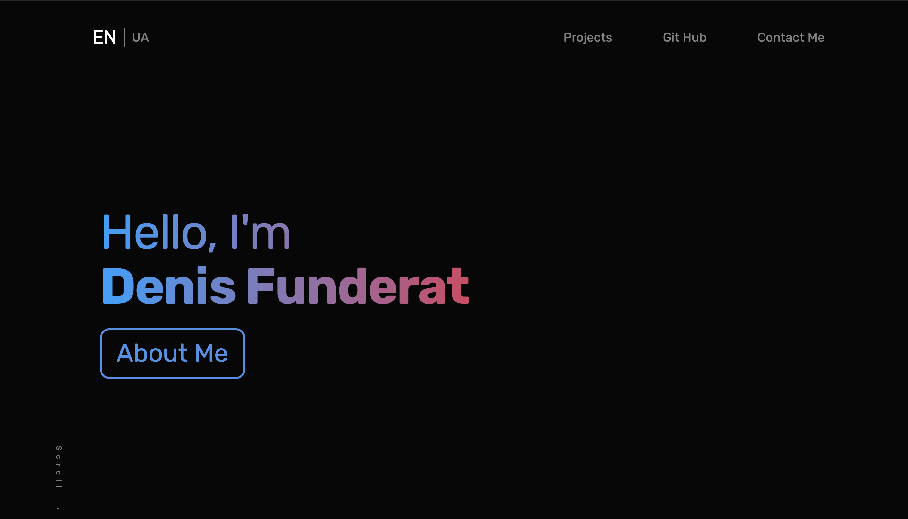
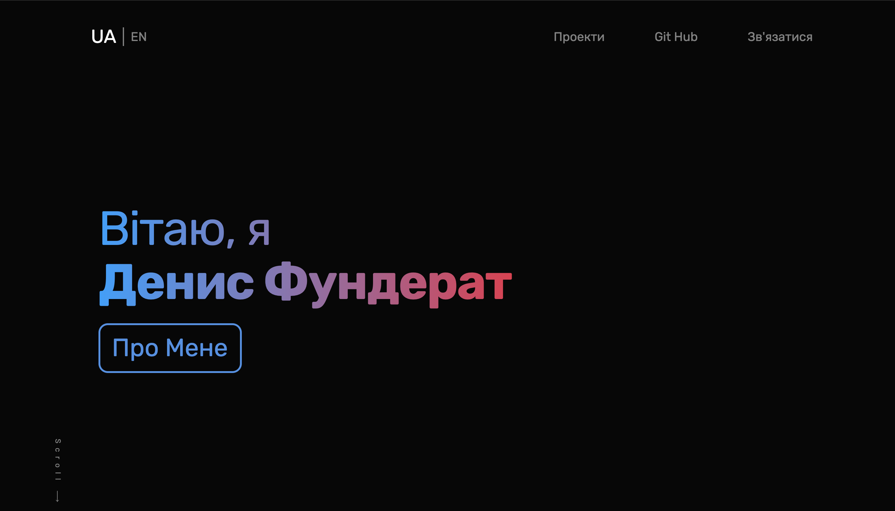
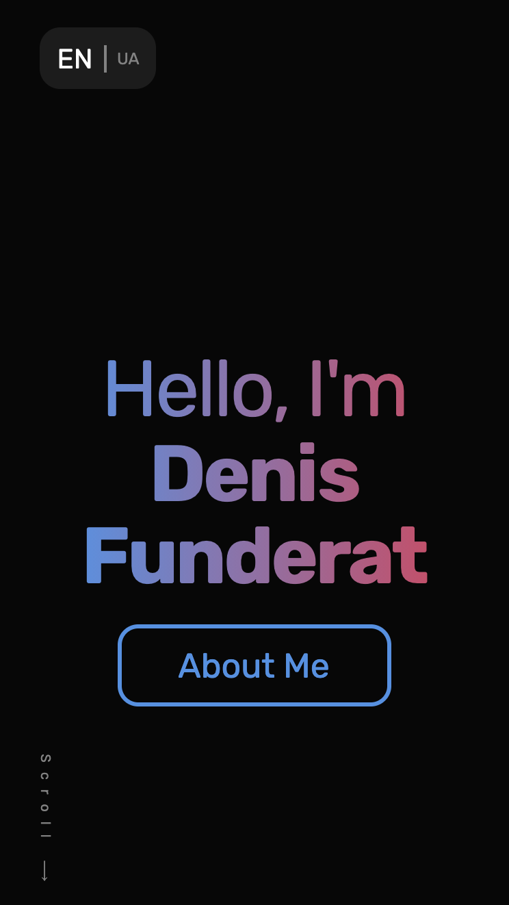
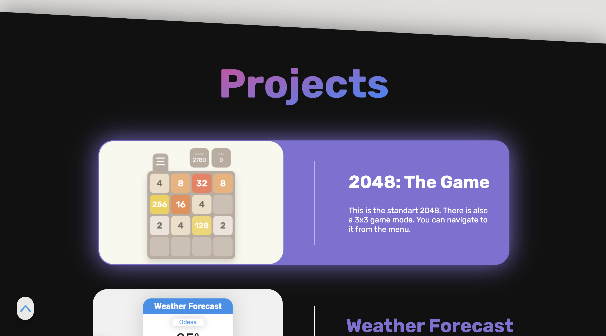
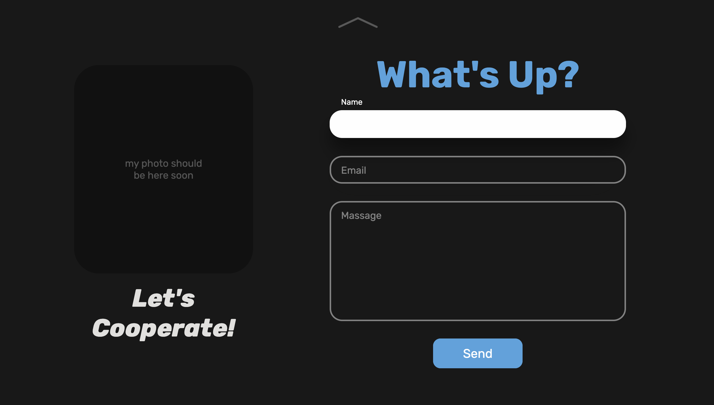

# 2048: The Game

This is my **`CV`**! It has all needed information about me and my work. And all that info translated into two languages: English and Ukrainian. So you can easily switch between them and your browser will memorized the choice.

-------

Project has an adaptive look, so with the help of GitHub Pages you can explore it on your phone
------

Here is the link: https://tufned.github.io/MyPortfolio/

-------

### Some projects of mine can be found in the CV

### And here is a contact form

 
